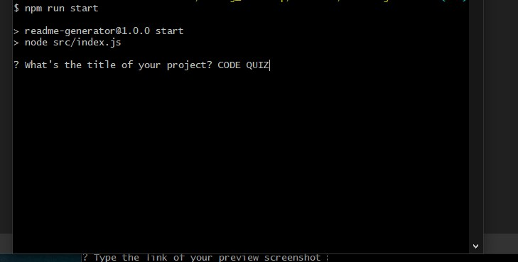

# README GENERATOR 

## Table of Contents
  
  - [Description](#description)
- [Installation](#installation)
- [Usage](#usage)
- [Testing](#testing)
- [License](#license)
- [Contact](#contact)
- [Contributing](#contributing)
- [Preview](#preview)
  
## Description

With this application you can create your next readme files from the command line. This readme has been generated using the application as well!
  
## Installation
  
Run the following script to install the packages required for the application:
      
```
Download the content and extract the files in a new folder.
```

## Testing
    
To test the application:
        
```
Type the following command in the opened terminal: npm run start
```

## Usage
  
To use the application run the following script:
      
```
Open a new terminal/command line in the path of the folder of this application.
```
  
## Contributing

To contribute the project:

```
Want to contribute? Fork this repository and commit on a new branch .
```
  
## License
  
MIT

## Questions
    
GitHub: [akeneagle](https://github.com/akeneagle)\
Email: akeneagle@gmail.com

## Preview

